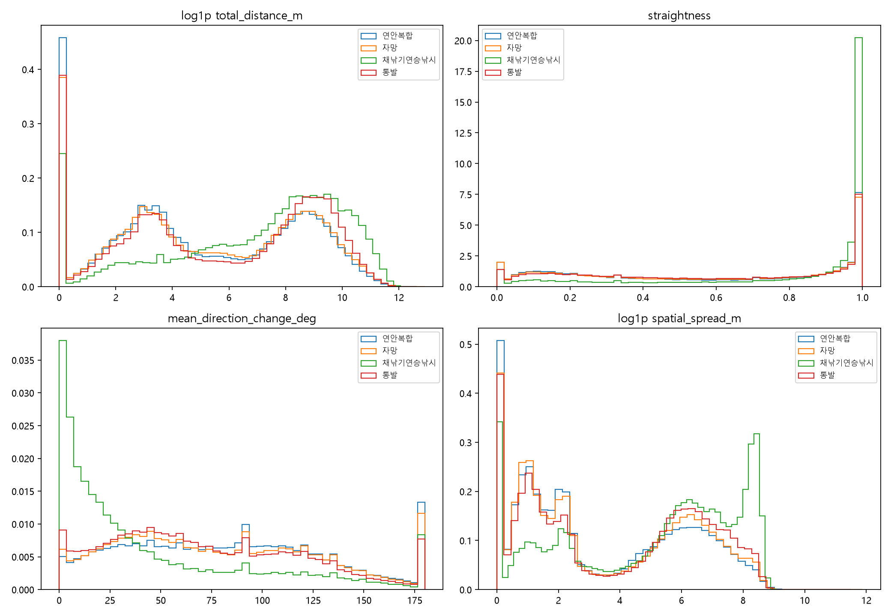
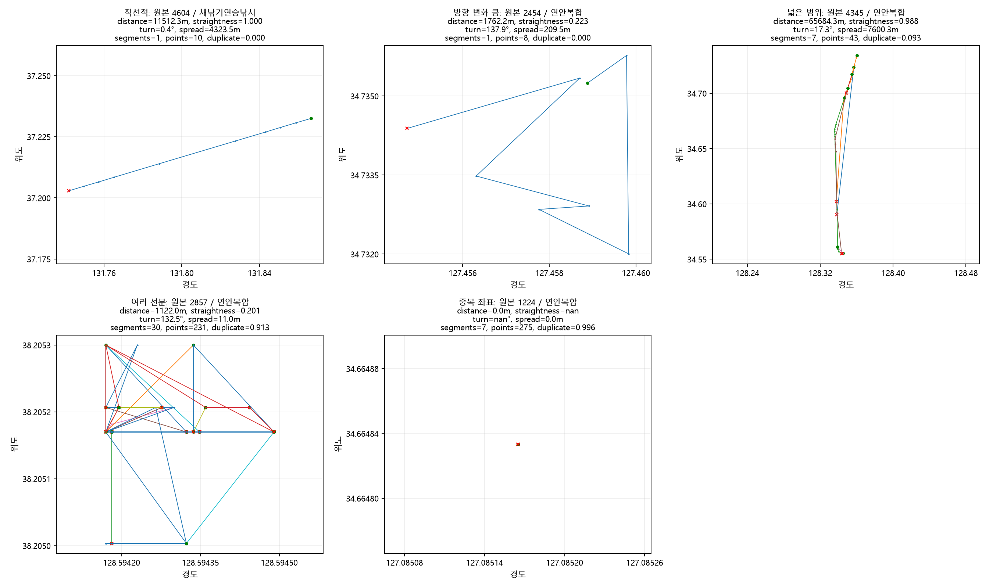
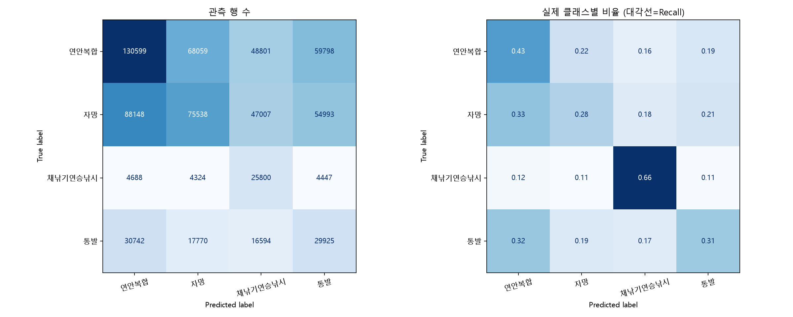
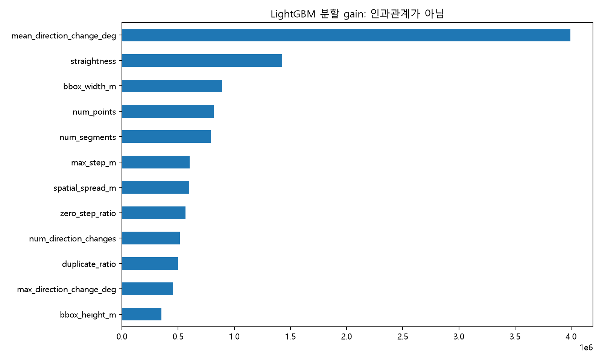
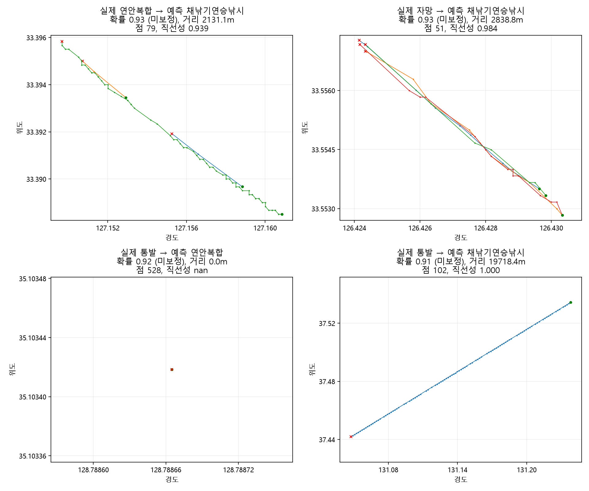

# 2주차 분석 기록

참가신청서 PDF 3~5쪽과 제공 원본을 직접 확인하고 공간 특징과 조업형태 분류 baseline을 구현했다.
실행 방법·특징 정의·팀원 교차검산은 [README](README.md)에 있다.

## 원본과 분석 기준

- 원본 6개월 CSV: 3,887,069행. 정상 메타데이터 기준 7,372척, 181일.
- 분석 단위: 선박(`rfid_id`)×날짜(`part_dt`)×시간대(`rfid_time`)의 원본 한 행. 정상 키 중복 0건.
- 정답: `fishing_code`의 업종 4개. 순간적인 조업 상태나 사고 정답이 아니다.
- 2월 geometry 결측 2행, 6월 손상된 인접 2행을 확인했다. 원본은 유지하고 제외 위치·사유를 저장했다.
- CRS 표기는 없다. 한국 주변의 경도·위도 범위에 근거한 Haversine 거리이며 정확한 기준 좌표계와 시간대는 미확인이다.
- 좌표별 시각이 없어 속도·가속도·체류시간은 계산하지 않았다. 선분 사이의 거리를 더하거나 방향을 연결하지 않았다.
- 사고 Excel 167행에는 선박 ID가 없다. 이번 분류 학습이나 선박 이력 연결에 사용하지 않았다.

최종 feature table은 **3,887,065행×23열(모델 입력 17개+메타데이터 6개)**이다.
생성 시간은 약 651초였고 전체 좌표 범위는 경도 123.21835~134.46041, 위도 30.00017~39.75021이다.
inf는 0개이며 전체 table에 대해 범위·개수·키 중복 및 아래 NaN 정의 일치를 코드로 검증했다.

| 결측 특징 | 행 수 | 이유 |
|---|---:|---|
| 직선성 | 404,299 | 관측 이동거리 0 |
| 평균·최대 방향 변화, 큰 변화 비율(각각) | 643,682 | 유효 방향 변화쌍 0개 |
| 나머지 13개 특징 | 0 | 모두 계산 가능 |

전체 NaN 셀은 2,335,345개다. 같은 행의 여러 특징에 생긴 NaN을 중복 합산한 값이므로 결측 행 수와 다르다.

## EDA에서 확인한 차이와 품질 문제

| 업종 | 행 수 | 선박 수 | 이동거리 중앙값(m) | 직선성 중앙값 | 공간 분산 중앙값(m) |
|---|---:|---:|---:|---:|---:|
| 연안복합 | 1,682,454 | 3,650 | 101.6 | 0.559 | 9.0 |
| 자망 | 1,422,674 | 2,520 | 163.7 | 0.572 | 10.2 |
| 채낚기연승낚시 | 180,878 | 158 | 2,605.1 | 0.950 | 385.9 |
| 통발 | 601,059 | 1,044 | 391.2 | 0.581 | 42.1 |

채낚기연승낚시는 상대적으로 길고 직선적이며 넓은 범위에 분포한다. 연안복합과 자망은 주요 분포가 많이 겹친다.
이는 이 자료의 관측 분포이며 업종의 보편적 인과 특성으로 단정하지 않는다.
행 수뿐 아니라 선박 수에서도 불균형이 크다. 전체 이동거리 중앙값은 179.9m, 공간 분산 중앙값은 11.3m로 작은 범위의 관측이 많다.

높은 Pearson 상관은 이동거리–선분 직선거리합 0.966, 평균 방향 변화–큰 변화 비율 0.922,
큰 변화 횟수–누적 방향 변화 0.986, 중복 좌표 비율–길이 0 이동 비율 0.959였다.
이번에는 정의를 고정한 baseline으로 모두 유지했으며, 서로 상관된 중요도를 독립 효과로 해석하지 않는다.

최대 관측 이동거리 408.5km, 최대 인접점 거리 306.1km라는 극단값이 있다.
2월 원본 375723행(0부터)의 **같은 선분**에 `(127.329998, 36.049998) → (126.846682, 33.325577)`가 실제 들어 있다.
따라서 306km 값은 코드가 끊어진 선분을 연결해 만든 오류가 아니다. 좌표 오류 또는 항적 생성 문제를 확인할 대상이다.
이 사례를 속도로 환산하거나 임의로 삭제하지 않았으며, 상위 20개는 `outputs/metrics/largest_steps.csv`에 기록했다.

## 실제 항적 검산

첫 5,000행에서 특징의 의미가 드러나는 사례를 골랐다. 모형 성능을 기준으로 선택하지 않았다.
거리 계산은 별도의 구면 코사인 법칙으로 합산해 비교했고 선분·점·중복 개수도 독립적으로 확인했다.

| 사례(1월 원본 행, 0부터) | 실제 계산 결과 | 해석 |
|---|---|---|
| 직선적, 4604 | 거리 11,512m, 직선성 0.999994, 평균 방향 변화 0.37° | 그림의 거의 직선인 형태와 일치 |
| 굴곡, 2454 | 거리 1,762m, 직선성 0.223, 평균 방향 변화 137.85° | 여러 차례 급격한 방향 변화와 일치 |
| 넓은 범위, 4345 | 공간 분산 7,600m, 남북 범위 19,937m | 작은 구역의 항적보다 분산이 큼 |
| 여러 선분, 2857 | 선분 30개, 점 231개, 분산 11m | 작은 범위의 반복·흔들림이 많아 방향 변화 해석에 주의 |
| 반복 좌표, 1224 | 점 275개, 거리 0m, 중복 비율 0.9964 | 직선성과 방향 변화는 정의 불가(NaN) |

거리 0인 예제의 분산에 남는 약 1e-8m는 부동소수점 합산 오차다.
좌표 순서가 정의하는 관측 이동거리이며, 관측 간격이 없어 물리적인 실제 이동과 GPS 오차를 완전히 구분할 수는 없다.

## 검증 구조

`GroupShuffleSplit(test_size=0.2, random_state=42)`로 선박을 분리한다.
동일 선박의 반복 행을 양쪽에 넣는 random row split은 사용하지 않는다.
17개 공간·품질 특징만 사용하고 선박 ID·날짜·시간·절대 위치·사고 정보는 입력에서 제외한다.
결측 대치나 표준화는 없고 LightGBM이 정의상 NaN을 직접 처리한다.
balanced class weight는 학습 label 분포에서 계산한다. 전체 EDA를 사용한 clipping·특징 선택·튜닝은 하지 않았다.
이 평가는 같은 기간의 미관측 선박에 대한 관측 행 단위 성능이다.

학습 5,897척·3,179,832행, 검증 1,475척·707,233행이며 **선박 교집합은 0**이다.
검증에는 연안복합 736척, 자망 502척, 채낚기연승낚시 33척, 통발 204척이 들어 있다.

## 기준모형 성능과 혼동

| 기준 | Accuracy | Macro-F1 |
|---|---:|---:|
| 학습 최다 업종(연안복합)만 예측 | 43.44% | 0.1514 |
| 공간 특징 LightGBM | **37.03%** | **0.3378** |

| 업종 | Precision | Recall | F1 | 검증 행 수 |
|---|---:|---:|---:|---:|
| 연안복합 | 0.5138 | 0.4250 | 0.4652 | 307,257 |
| 자망 | 0.4559 | 0.2843 | 0.3502 | 265,686 |
| 채낚기연승낚시 | 0.1867 | 0.6572 | 0.2908 | 39,259 |
| 통발 | 0.2006 | 0.3149 | 0.2451 | 95,031 |

전체 성능은 낮다. Macro-F1은 다수 클래스 기준보다 개선됐지만 Accuracy는 오히려 낮다.
모든 업종을 충분히 구분한다고 해석할 수 없으며, 이번 결과는 다음 실험을 비교할 출발점이다.
소수 업종인 채낚기연승낚시 Recall은 가장 높지만 Precision은 18.67%로 낮아 다른 업종을 이 업종으로 많이 잘못 예측한다.
balanced class weight를 사용한 결과이며, 가중치 유무의 효과 자체는 별도의 비교 실험 없이는 단정하지 않는다.

가장 큰 혼동은 **자망→연안복합 88,148행(실제 자망의 33.18%)**, **연안복합→자망 68,059행(22.15%)**이다.
두 방향 합계 156,207행이다. 통발도 연안복합으로 30,742행을 잘못 분류해, 실제 통발을 맞춘 29,925행보다 많다.
연안복합·자망의 공간 분포가 겹친다는 EDA와 부합하지만 원인이라고 확정할 수는 없다.

## 어떤 특징이 구분에 기여했는가

분할 gain 상위는 **평균 방향 변화, 직선성, bbox 동서 폭, 점 수, 선분 수**다.
형태를 설명하는 방향 변화·직선성과 관측 품질·수집량을 나타내는 점/선분 수를 함께 사용했다.
채낚기연승낚시의 직선성·이동거리·공간 분산은 EDA에서도 다른 업종과 차이가 있었으나,
이 특징만으로 충분히 분류되는 것은 아니다(해당 업종 Precision 18.67%).
gain은 학습 분할에서 사용된 정도이며 인과관계·검증 성능 기여량은 아니다. 상관된 특징 사이에 중요도가 분산된다.

## 현재 특징의 한계

한 시간대의 짧은 항적에는 이동·대기·정박에 가까운 구간이 섞인다. 같은 업종의 전체 조업 과정을 모두 보여주지 않는다.
점 수가 적으면 두 점 선분의 직선성은 항상 1이고 방향 변화를 계산할 수 없다.
반복 좌표·GPS 흔들림은 선회 지표를 부풀릴 수 있으며, 큰 좌표 점프가 실제 원본에 존재한다.
지리적 위치와 이전 시간대의 움직임은 사용하지 않아 업종 구분에 도움이 될 맥락이 부족할 수 있다.
이 제한은 신청서에서 제안한 과거 시간대 집계와 품질 검증의 필요성을 뒷받침하는 실험 가설이다.
현재 결과는 단일 그룹 holdout이고, 같은 선박의 반복 관측으로 구성된 행별 지표이므로 독립 표본 수가 70만 개라고 볼 수는 없다.

오분류 그림은 서로 다른 혼동 조합에서 예측 확률이 높은 4개 사례를 고른 것이다. 전체 오류의 대표 표본은 아니다.
직선성이 높은 연안복합·자망·통발 항적이 채낚기연승낚시로 오분류되었고,
통발의 동일 좌표 528개로 이루어진 항적은 연안복합으로 분류되었다.
첫 사례는 5월 원본 319544행(직선성 0.939), 두 번째는 6월 772484행(0.984),
정지 사례는 4월 645322행, 긴 직선 통발 사례는 2월 90785행(0.9998)이다.
한 구간의 모양만으로 선박의 업종을 확정하기 어렵다는 점을 전원이 그림과 함께 확인할 수 있다.

점 수 2~5개 구간의 Macro-F1은 0.2486, 6~20개는 0.3504, 21~100개는 0.3226, 101개 이상은 0.3049였다.
단순히 점 수가 많다고 성능이 높아지지 않았다. 구간별 업종·선박 구성도 다르므로 점 수의 인과 효과로 해석하지 않는다.

검증을 마친 산출물: 원본 6개 파일 전체 특징 생성, 실제 항적 5개 독립 검산, 경계 사례 테스트 3개,
전체 특징의 범위·NaN 정의·중복 검사, 저장 예측 707,233행에서 metric 재계산 일치,
저장 모델 재로딩 후 512행 확률 일치(최대 차이 약 5e-8, CSV 출력 반올림 범위).
Windows 한글 경로에서 발생한 LightGBM 저장 오류는 모델 문자열을 Python으로 저장하도록 수정했고 재실행을 완료했다.

## 3주차로 이어지는 확인 항목

1. 선박 그룹 교차검증으로 분할에 따른 변동을 확인하고 행별 평가와 선박별 평가를 함께 비교한다.
2. 시간대 정의와 관측 연속성을 확인한 뒤 과거 방향으로만 시간대 특징을 집계한다. 정박·짧은 구간만으로 업종을 판단하는 한계를 점검한다.
3. 좌표계·선분 생성 규칙·6월 손상 원본을 확인하고 긴 점 간 간격·GPS 흔들림에 대한 품질 기준은 학습 자료에서 정한다.
4. 점 수·중복 비율 등 관측 품질 특징과 이동 형태 특징의 제거 실험으로 수집 방식 의존도를 점검한다.
5. 절대 위치는 현재 미사용이다. 향후 추가할 때 위치 의존도와 신규 해역 일반화를 별도로 검증한다.

사고 연결과 이상탐지 정상 기준·시간순 검증은 후속 주차 범위다. 이번에 사고 예측이나 이상탐지 성능을 주장하지 않는다.
전원 공통 실행과 사람 간 교차검산 체크리스트는 README에 미체크 상태로 제공했다.
